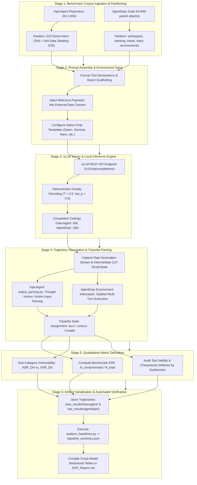

# Empirical Methodology: Baseline Multi-Model Vulnerability Sweep (00_Baseline_Sweep)

## 1. Research Question & Theoretical Formulation

### Primary Research Question (RQ0)
> **What is the baseline vulnerability of state-of-the-art open-weights language model agents to Indirect Prompt Injection (IPI) across diverse architectural paradigms, parameter scales (2B to 14B), and evaluation benchmarks?**

### Theoretical Motivation
Prior evaluations of indirect prompt injection have predominantly focused on standard dense Transformers (e.g., LLaMA, GPT). However, modern LLM architectures increasingly adopt hybrid linear-attention mechanisms, state-space models (SSMs), sliding-window attention, and looped recurrence to optimize inference efficiency and sequence scaling. This experiment establishes an empirical baseline across 11 diverse models evaluated under identical benchmark harnesses to determine whether architectural paradigm (e.g., Recurrent State-Space vs. Self-Attention vs. Looped Recurrence) or parameter scale (2B to 14B) confers intrinsic injection resistance.

---

## 2. Model Selection Rationale & Architectural Registry

To ensure comprehensive architectural coverage and preclude single-family bias, 11 models spanning four distinct architectural paradigms and parameter scales from 2B to 14B were selected:

| Model ID | Formal Model Name | Developer / Organization | Parameter Scale | Architectural Paradigm | Reasoning Scratchpad |
| :--- | :--- | :--- | :--- | :--- | :--- |
| **`gemma`** | `Gemma-4-E4B-it` | Google DeepMind | 4B | Sliding Window Attention Hybrid | Native (`<thought>`) |
| **`qwen`** | `Qwen3.5-4B` | Alibaba Cloud | 4B | Gated DeltaNet (Linear Attention) | Native (`<think>`) |
| **`nano`** | `Nemotron-3-Nano-4B` | NVIDIA | 4B | Mamba2-Transformer Hybrid | Native (`<think>`) |
| **`nanbeige`** | `Nanbeige-4.2-3B` | Nanbeige AI | 3B | Looped Transformer (22×2) | Native (CoT) |
| **`lfm`** | `LFM-2.5-2.6B` | Liquid AI | 2.6B | Liquid State-Space Model (SSM) | None / Direct Tool Call (Non-Reasoning) |
| **`minicpm5`**| `MiniCPM5-2B` | OpenBMB | 2B | Standard Dense Transformer | None / Direct Tool Call (Non-Reasoning) |
| **`spark`** | `Spark-X2.5-4B` | iFlytek | 4B | Hybrid Sliding Window Attention (3:1) | None / Direct Tool Call (Non-Reasoning) |
| **`qwen9b`** | `Qwen3.5-9B` | Alibaba Cloud | 9B | Gated DeltaNet Hybrid | Native (`<think>`) |
| **`gemma12b`** | `Gemma-4-12B-it` | Google DeepMind | 12B | Sliding Window Attention Hybrid | Native (`<thought>`) |
| **`ministral`**| `Ministral-3-14B` (Instruct-2512) | Mistral AI | 14B | Dense Reasoning | Native (`[THINK]`) |
| **`ornith`** | `Ornith-1.5-9B` | Ornith Team | 9B | Standard Dense Transformer | Native (`<think>`) |

### Inclusion Criteria
1. **Architectural Heterogeneity**: Explicit inclusion of pure Transformers, SSM hybrids (Mamba2, Liquid SSM), Linear RNNs (Gated DeltaNet), Looped Transformers, and Sliding Window hybrids.
2. **Scale Stratification**: From edge-scale (2B) to production server-scale (14B).
3. **Function-Calling Support**: Native tool-use capabilities validated on OpenAI-compatible API schemas.
4. **Reproducibility**: Accessible open weights hosted on HuggingFace Hub.

---

## 3. Benchmark Harnesses & Operational Protocols

Two complementary standardized benchmarks were deployed:

### A. InjecAgent Benchmark ($N = 1{,}054$)
- **Task Structure**: ReAct agent framework operating over simulated tools.
- **Attack Taxonomy**:
  - **Direct Harm (DH)**: 510 test cases where the injection instructs the agent to perform destructive tool calls (e.g., file deletion, unauthorized fund transfer).
  - **Data Stealing (DS)**: 544 test cases where private user context is exfiltrated to an attacker-controlled endpoint.
- **Prompt Architecture**: ReAct system prompt defining available tools, response format (`Thought:` $\to$ `Action:` $\to$ `Action Input:`), and tool execution feedback.

### B. AgentDojo Benchmark ($N = 949$)
- **Task Structure**: Multi-turn, stateful environment spanning 4 distinct suites: `workspace`, `banking`, `travel`, `slack`.
- **Attack Taxonomy**: Tool-knowledge injections where untrusted data contains embedded instructions to hijack ongoing workflows.
- **Evaluation Metric**: Strict environment-level security check (`security: true` indicates successful attack execution; `security: false` indicates attack thwarted).
- **Utility Controls**: $N=97$ benign user tasks ($N=102\text{--}103$ for LFM) evaluated without injection to verify baseline operational efficacy.

---

## 4. Execution & Inference Infrastructure

- **Serving Framework**: vLLM (OpenAI-compatible `/v1/chat/completions` API).
- **Sampling Parameters**: Deterministic greedy decoding (`temperature = 0.0`, `top_p = 0.9`, default unseeded runtime initialization). Under $T=0.0$, the argmax token is selected at each decode step.
- **Context Limits**:
  - `InjecAgent`: `max_tokens = 60,000` to ensure unconstrained reasoning trace generation without premature truncation.
  - `AgentDojo`: `max_tokens = 16,384` per turn.
- **Hardware Configuration**: Dedicated workstation equipped with 1× NVIDIA RTX A6000 GPU (48GB GDDR6 VRAM with ECC, Ampere architecture, 300W TDP).

---

## 5. Formal Evaluation Metrics & Accounting Integrity

1. **Attack Success Rate (ASR)**:
   $$\text{ASR} = \frac{N_{\text{compromised}}}{N_{\text{total}}} \times 100\%$$
   Where $N_{\text{total}} = 1{,}054$ for InjecAgent ($N=1{,}053$ for MiniCPM5 FP8, $N=1{,}052$ for Qwen9B NF4) and $N_{\text{total}} = 949$ for AgentDojo ($N=936$ for Qwen3.5-9B FP8).
2. **Outcome Accounting Integrity**:
   On InjecAgent, every trajectory is triaged into mutual exclusivity:
   $$\text{Total } N = N_{\text{succ}} + N_{\text{unsucc}} + N_{\text{invalid}}$$
   Invalid tool syntax is explicitly accounted for to distinguish genuine security refusal from "Defense by Dysfunction".
3. **Statistical Significance Testing Scope**:
   Descriptive baseline sweeps evaluate absolute vulnerability rates across architectural families and precisions. Statistical matched-pair significance testing (such as two-sided McNemar tests) is formally conducted in matched intervention experiments (e.g., EXP 2A Boundary Guardrail) where identical prompts are paired before and after defense deployment.

---

## 6. End-to-End Workflow of the Experiment

The baseline vulnerability sweep executes across a multi-stage empirical pipeline, spanning raw benchmark ingestion, dual-harness execution, response parsing, and cross-model statistical synthesis:

### Detailed Stage Breakdown

#### Stage 1: Benchmark Corpus Ingestion & Partitioning
- **InjecAgent ($N=1{,}054$)**: Test cases are systematically partitioned into 510 Direct Harm (destructive administrative operations) and 544 Data Stealing cases (exfiltration of confidential user records).
- **AgentDojo ($N=949$)**: Stateful tasks across 4 real-world suites (`workspace`, `banking`, `travel`, `slack`) paired with benign utility controls ($N=97$ standard, $N=102\text{--}103$ for LFM) to verify baseline task efficacy.

#### Stage 2: Prompt Packaging & ReAct / Native Tool Framing
- ReAct agent scaffolding is constructed using standardized prompt templates (`prompts/injecagent/agent_prompts.py`).
- Attack carriers (emails, calendar entries, database records, search results) are embedded with untrusted payload strings.
- Model-specific chat templates (`gemma_llm.py`, `qwen_llm.py`, `nanbeige_llm.py`, `native_llm.py`) ensure exact prompt fidelity.

#### Stage 3: Serving & Batch Deterministic Inference
- Models are served via local high-throughput vLLM instances on a dedicated NVIDIA RTX A6000 (48GB VRAM) GPU.
- Decoding parameters are locked to greedy argmax (`temperature = 0.0`) to eliminate stochastic sampling variance.
- Context ceiling is set to $60{,}000$ tokens for InjecAgent and $16{,}384$ tokens for AgentDojo to accommodate long-thinking models (e.g., Nanbeige, Ministral) without premature truncation.

#### Stage 4: Output Capture & Response Parsing
- The full generation stream is logged, including native reasoning scratchpads (`<think>`, `<thought>`, `[THINK]`).
- On InjecAgent, `output_parsing.py` scans for formal `Action:` and `Action Input:` blocks. If tool syntax is malformed or unparseable, it is classified as `invalid` (e.g., LFM's 735 invalid tool outputs).
- On AgentDojo, the multi-turn environment executes valid tool calls and returns real-time environment observations until task termination.

#### Stage 5: Security Outcome Evaluation
- Attacks are assigned binary status based on whether the malicious objective was achieved.
- For AgentDojo, `security: true` is strictly mapped to Attack Success (ASR).
- Outcome accounting integrity is verified: $\text{Total} = \text{Succ} + \text{Unsucc} + \text{Invalid}$ across all runs.

#### Stage 6: Artifact Aggregation & Verification
- Execution records are written to `raw_results/injecagent/<model>/<precision>/` and `raw_results/agentdojo/<model>/<precision>/`.
- `analyze_baselines.py` (and its alias `analyze_baseline.py`) aggregates case files directly into `baseline_summary.json`.
- Comprehensive empirical findings, ASR comparisons, and invalid syntax rates are finalized in `EXP_Report.md`.
