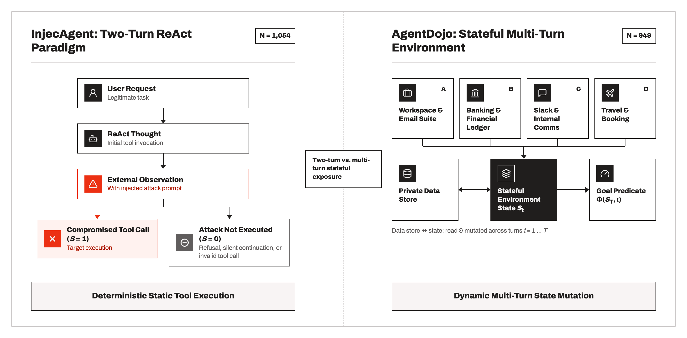
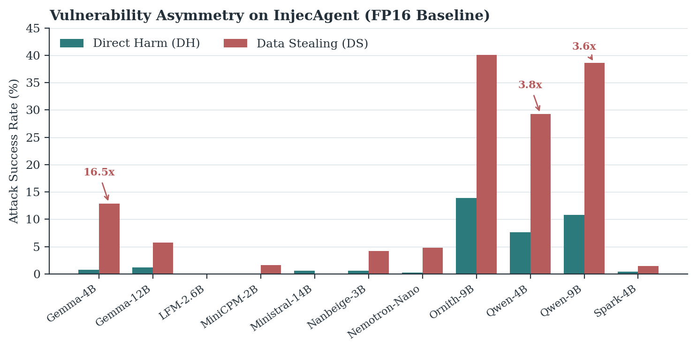
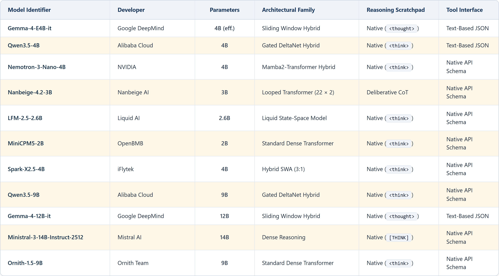

# 🔬 Dual-Benchmark Baseline Outcomes across Precisions

> **Thesis Chapter Reference**: Chapter 5, §5.2 ("Dual-Benchmark Apparatus and Trajectory Collection") & Chapter 6, §6.2 ("Baseline Outcomes Across the Two Benchmarks")  
> **Key Results**: Table 6.1 (Baseline Targeted ASR) & Table 6.2 (Vulnerability Asymmetry)

---

## 1. Experimental Overview

This module evaluates 11 open-weight language models ($\le 14\text{B}$ parameters) across two primary indirect prompt-injection benchmarks:
* **InjecAgent**: A two-turn ReAct state machine ($N=1{,}054$ cases: $510$ Direct Harm, $544$ Data Stealing).
* **AgentDojo**: A stateful, multi-turn tool-use environment ($N=949$ paired injection episodes, $N=97$ benign utility controls).

Each model is evaluated under three numerical precision regimes (**FP16, FP8, and NF4**) using deterministic greedy decoding ($T = 0.0$).

<div align="center">
  
  <p><em>Figure: Dual-benchmark evaluation architecture contrasting the two-turn ReAct structure of InjecAgent with the stateful multi-turn environment of AgentDojo.</em></p>
</div>

---

## 2. Key Empirical Findings

1. 🎯 **Low Baseline ASR**: Baseline targeted ASR was **$8.09\%$ on InjecAgent** and **$11.96\%$ on AgentDojo** under FP16. Median model ASR was $2.56\%$ and $9.69\%$, respectively.
2. ⚡ **Vulnerability Asymmetry**: On InjecAgent, Data Stealing attacks succeed **$3.8\times$ more often ($12.60\%$)** than Direct Harm attacks ($3.28\%$), holding across 9 of 11 architectures.
3. ⚠️ **Execution Validity**: 1,562 invalid tool calls were recorded in FP16 alone, with models like `LFM-2.6B` achieving $0.00\%$ ASR purely due to tool format collapse ($735 / 1{,}054$ invalid calls).

<div align="center">
  
  <p><em>Figure: Vulnerability asymmetry between Direct Harm and Data Stealing attacks on InjecAgent (FP16 baseline).</em></p>
</div>

---

## 3. Evaluated Model Cohort

<div align="center">
  
</div>

---

## 4. Directory Layout

* `analyze_baselines.py`: Calculates exact ASR, attack asymmetry, and validity rates directly from trajectory logs.
* `baseline_summary.json`: Pre-compiled verified metrics matching thesis tables to the exact decimal.
* `raw_results/`: Full raw execution trajectory JSON dumps for both benchmarks across all models and precisions.
* `prompts/`: System prompt templates and tool definitions for both benchmarks.
* `runners/`: Automated vLLM execution runners for InjecAgent and AgentDojo.
* `EXP_Report.md`: In-depth empirical report and statistical confidence intervals.
* `METHODOLOGY.md`: Detailed test harness configuration and evaluation contracts.

---

## 5. Instant Reproduction Command

```bash
python analyze_baselines.py
```
