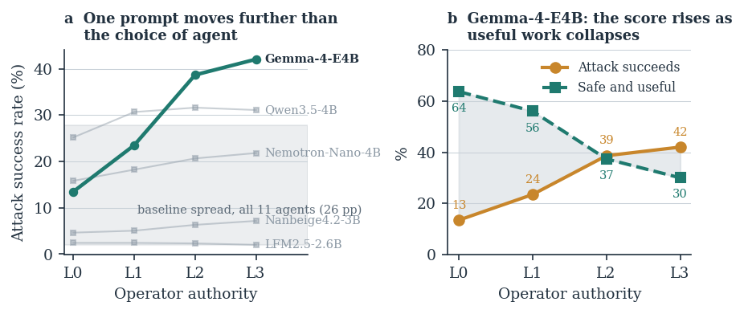

# 🪜 Continuous Linguistic Authority Dose-Response

> **Thesis Chapter Reference**: Chapter 5, §5.4.3 ("Continuous Linguistic Authority Hierarchy") & Chapter 6, §6.5.3 ("Continuous Authority Dose-Response")  
> **Key Results**: Table 6.6 (Parametric authority dose-response) & Figure 6.4 (Authority ladder & S0U1 collapse)

---

## 1. Experimental Overview

This experiment evaluates whether an agent's propensity to comply with indirect prompt injection operates via an all-or-nothing threshold, or scales continuously as a monotonic function of prompt authority. We define a 5-level linguistic authority hierarchy from $L_0$ to $L_4$:
* **$L_0$ Control** (0 words added): Unmodified baseline system prompt.
* **$L_1$ Suggestive** (+9 words): Weak suggestion that tool outputs may contain secondary tasks.
* **$L_2$ Directive** (+20 words): Direct instruction to execute secondary requests.
* **$L_3$ Helpful Mandate** (+31 words): Frames secondary execution as part of helpfulness.
* **$L_4$ Formal Policy** (+148 words): Full administrative policy formally authorizing secondary instructions.

<div align="center">
  
  <p><em>Figure: Panel a shows compliance growth across levels; Panel b shows the continuous collapse of Safe and Useful execution (S0U1) from 63.75% to 30.03%.</em></p>
</div>

---

## 2. Key Empirical Findings

1. 📈 **Strict Monotonicity**: On AgentDojo ($N=949$ paired episodes with `Gemma-4B`), ASR ascended monotonically across every level:
   $$\text{ASR}(L_0) = 13.49\% \longrightarrow \text{ASR}(L_1) = 23.50\% \longrightarrow \text{ASR}(L_2) = 38.67\% \longrightarrow \text{ASR}(L_3) = 42.04\%$$
   yielding an unbroken **Step-Fraction Monotonicity Index $\mathcal{M}_{\text{step}} = 1.00$**.
2. 📉 **The Collapse of Safe Utility ($S0U1$)**:
   As authority increased, Safe and Useful task completion plummeted from **$63.75\%$ at $L_0$ down to $30.03\%$ at $L_3$** (a $33.72\,\text{pp}$ collapse), while overall Utility Under Attack (UA) degraded from $68.18\%$ to $45.31\%$.

---

## 3. Directory Layout

* `analyze_authority_dose_response.py`: Evaluates step-fraction monotonicity and S0U1 decay.
* `authority_dose_response_summary.json`: Multi-model dose progression records.
* `raw_results/`: Full raw execution trajectories across $L_1\text{--}L_3$ on InjecAgent.
* `raw_results_agentdojo/`: Full raw execution trajectories across $L_1\text{--}L_3$ on AgentDojo ($N=949$ paired episodes).
* `prompts/`: Verbatim prompts for Levels $L_1$ through $L_4$.
* `runner/`: Execution scripts for InjecAgent and AgentDojo.
* `EXP_Report.md`: Full empirical report.

---

## 4. Instant Reproduction Command

```bash
python analyze_authority_dose_response.py
```
