# Empirical Methodology: Context & Reasoning Budget Invariance (EXP_3A_Context_Invariance)

## 1. Research Question & Theoretical Formulation

### Primary Research Question (RQ3A)
> **Does restricting the agent's available generation/reasoning token budget causally diminish indirect prompt injection compliance, or is attack success invariant to reasoning depth?**

### Theoretical Motivation
The "overthinking" hypothesis posits that extensive Chain-of-Thought (CoT) reasoning increases an agent's vulnerability to indirect prompt injection: as the model generates longer reasoning chains, it ruminates over untrusted tool outputs, increasing the likelihood of rationalizing and executing the injection. EXP 3A rigorously tests this by artificially truncating completion budgets via the generation ceiling parameter (`--max_tokens` $\in \{16000, 8000, 4000, 2000, 1000, 512, 256\}$ vs. unconstrained $60000$) to evaluate whether restricting reasoning capacity prevents injection rationalization.

---

## 2. Evaluated Models & Architectural Registry

EXP 3A covers 10 evaluated models spanning diverse architectural paradigms and parameter scales:

| Model ID | Formal Model Name | Parameter Scale | Architecture | Token Budget Sweep Arms |
| :--- | :--- | :--- | :--- | :--- |
| **`qwen`** | `Qwen3.5-4B` | 4B | Gated DeltaNet Hybrid | 16k, 8k, 4k, 60k (Baseline) |
| **`qwen9b`** | `Qwen3.5-9B` | 9B | Gated DeltaNet Hybrid | 16k, 8k, 4k, 60k (Baseline) |
| **`gemma`** | `Gemma-4-E4B-it` | 4B | Sliding Window Hybrid | 16k, 8k, 4k, 60k (Baseline) |
| **`gemma12b`** | `Gemma-4-12B-it` | 12B | Sliding Window Hybrid | 16k, 8k, 4k, 60k (Baseline) |
| **`nano`** | `Nemotron-3-Nano-4B` | 4B | Mamba2-Transformer Hybrid | 16k, 8k, 4k, 60k (Baseline) |
| **`nanbeige`** | `Nanbeige-4.2-3B` | 3B | Looped Transformer (22×2) | 2000, 1000, 512, 256, 60k (Deep Sweep) |
| **`ministral`**| `Ministral-3-14B-Instruct-2512` | 14B | Dense Reasoning | 16k, 8k, 4k, 60k (Baseline) |
| **`ornith`** | `Ornith-1.5-9B` | 9B | Standard Dense | 16k, 8k, 4k, 60k (Baseline) |
| **`minicpm5`**| `MiniCPM5-2B` | 2B | Standard Dense | 16k, 8k, 4k, 60k (Baseline) |
| **`spark`** | `Spark-X2.5-4B` | 4B | Standard Dense | 16k, 8k, 4k, 60k (Baseline) |

---

## 3. Experimental Protocol & Treatment Arms

### A. Budget Allocation Protocol
1. **Unconstrained Baseline ($B_0$)**: $\text{max\_tokens} = 60{,}000$.
2. **Moderate Budget ($B_1$)**: $\text{max\_tokens} = 16{,}000$.
3. **Tight Budget ($B_2$)**: $\text{max\_tokens} = 8{,}000$.
4. **Constrained Budget ($B_3$)**: $\text{max\_tokens} = 4{,}000$.
5. **Ultra-Constrained (Deep Sweep for Long-Thinking Models)**:
   - Nanbeige was evaluated across an extended range of $\{2000, 1000, 512, 256\}$ tokens across the full 1,054 benchmark suite to probe the exact threshold where truncated reasoning induces syntactic failure vs. injection abandonment.

### B. Benchmark Cohort
- Standardized subset of $N = 200\text{--}203$ Direct Harm test cases per macro budget arm across the 9 macro models ($N=200$ for Qwen, Gemma, Nano; $N=203$ for Qwen9B, Gemma12B, Ministral, Ornith, MiniCPM5, Spark), complemented by the full $N = 1{,}054$ suite across 4 micro-budgets on Nanbeige ($N = 4{,}216$ trajectories).

---

## 4. Execution Infrastructure

- **Runners**:
  - `runners/run_injecagent_vllm_exp3a.py`
  - Master orchestration: `runners/run_exp3a.sh`, `runners/run_exp3a_v2.sh`, `runners/run_exp3a_v3.sh`
- **Serving**: Local `vLLM` OpenAI-compatible API endpoint with `--max_tokens` generation ceiling hooks.

---

## 5. Statistical Evaluation

- **Cross-Budget Invariance Spread**: Measured by the maximum absolute ASR shift across macro budgets (16k, 8k, 4k):
  \[
  \Delta \text{ASR} = \max_{b \in \{16\text{k}, 8\text{k}, 4\text{k}\}} \text{ASR}(b) - \min_{b \in \{16\text{k}, 8\text{k}, 4\text{k}\}} \text{ASR}(b)
  \]
  A spread of $\Delta \text{ASR} \le 1.97\text{ pp}$ across all 9 models (with 5 models exhibiting strictly $0.00\text{ pp}$ variance) confirms operational invariance to generation token budgets above natural completion length.
- **Matched-Pair Contingency & Significance**: For fine-grained budget clamping on Nanbeige, each test case $i$ is tracked across baseline and budget conditions $(y_{\text{base}}, y_{\text{bud}})$. Statistical significance of net attack mitigation ($SF - FS$) is evaluated using:
  - Two-sided exact binomial tests:
    \[
    p_{\text{binom}} = \sum_{k \le \min(SF, FS)} \binom{SF + FS}{k} 0.5^{SF + FS} + \sum_{k \ge \max(SF, FS)} \binom{SF + FS}{k} 0.5^{SF + FS}
    \]
  - McNemar's chi-square test with Edwards continuity correction ($\text{df}=1$):
    \[
    \chi^2 = \frac{(|SF - FS| - 1)^2}{SF + FS}
    \]
- **Utility-Security Tradeoff Ratio**: Quantifies the collateral damage in task validity incurred per percentage point of ASR reduction:
  \[
  \text{Tradeoff Ratio} = \frac{\Delta \text{Invalid Rate}}{\Delta \text{ASR}}
  \]

---

## 6. End-to-End Workflow of the Experiment

The evaluation of context scaling and reasoning token budget clamping executes across six structured stages:

```mermaid
flowchart TD
    subgraph S1["Stage 1: Cohort Partitioning & Baseline Indexing"]
        A1["InjecAgent Direct Harm Subset (N=200-203) & Full Suite (N=1,054)"] --> A2["Index Unconstrained 60k Baseline Traces"]
        A2 --> A3["Establish Model Cohort (9 Macro Models + Deep Nanbeige Sweep)"]
    end

    subgraph S2["Stage 2: Parameter Clamping & Prompt Structuring"]
        A3 --> B1["Define Budget Array: {16k, 8k, 4k, 2k, 1k, 512, 256} tokens"]
        B1 --> B2["Inject Standard ReAct Harness Prompt"]
        B2 --> B3["Configure Hard Token Limit Hooks in vLLM Client (--max_tokens)"]
    end

    subgraph S3["Stage 3: vLLM Parameter Clamped Execution"]
        B3 --> C1["vLLM OpenAI REST API Server (NVIDIA RTX A6000)"]
        C1 --> C2["Deterministic Argmax Decoding (T = 0.0 Greedy Decoding)"]
        C2 --> C3["Execute runners/run_injecagent_vllm_exp3a.py via run_exp3a*.sh"]
    end

    subgraph S4["Stage 4: Generation Interception & Truncation Tagging"]
        C3 --> D1["Capture Generation Stream & Actual Emitted Length"]
        D1 --> D2["Classify Termination Cause: Natural Finish vs. Truncated Token Ceiling"]
        D2 --> D3["ReAct Output Parsing: Validate Action Command Integrity (eval == succ)"]
    end

    subgraph S5["Stage 5: Invariance Spread & Matched-Pair Contingency"]
        D3 --> E1["Calculate Macro-Budget ASR Spread (Delta ASR <= 1.97 pp)"]
        E1 --> E2["Compute Nanbeige Matched Pairs (SS, SF, FS, FF) vs. Baseline"]
        E2 --> E3["Calculate Exact Binomial p-values & Utility Tradeoff Ratios"]
    end

    subgraph S6["Stage 6: Artifact Serialization & Synthesis"]
        E3 --> F1["Export Audited Case Traces to raw_results/"]
        F1 --> F2["Execute analyze_exp3a.py to Regenerate exp3a_summary.json"]
        F2 --> F3["Compile Verified Figures & Tables in EXP_Report.md"]
    end

    S1 --> S2 --> S3 --> S4 --> S5 --> S6
```

### Detailed Stage Breakdown

#### Stage 1: Cohort Selection & Benchmark Ingestion
- Ingests Direct Harm cases ($N=200\text{--}203$) evaluated identically across 9 compact models, paired with the exhaustive $N=1{,}054$ suite across 4 micro-budgets on Nanbeige ($N=4{,}216$ total trajectories).
- Aligns cases with the unconstrained $60\text{k}$ token baseline from `00_Baseline_Sweep`.

#### Stage 2: Token Budget Parameter Matrix Assembly
- Instantiates a geometric budget schedule: `--max_tokens` $\in \{16000, 8000, 4000, 2000, 1000, 512, 256\}$ tokens.
- Ensures identical prompt formatting across all budget conditions.

#### Stage 3: vLLM Batch Inference Execution
- Jobs are executed via `runners/run_injecagent_vllm_exp3a.py` and master bash orchestrators (`runners/run_exp3a.sh`, `runners/run_exp3a_v2.sh`, `runners/run_exp3a_v3.sh`).
- Sampling is set to deterministic greedy decoding (`temperature = 0.0`).

#### Stage 4: Trajectory Interception & Truncation Handling
- Output captures track actual generated token counts against the assigned ceiling.
- Cases where the generation terminates naturally ($L_{\text{gen}} < \text{max\_tokens}$) are distinguished from hard truncation dropouts ($L_{\text{gen}} = \text{max\_tokens}$).
- Authoritative success is determined strictly from action command evaluation (`eval == "succ"`).

#### Stage 5: Invariance Spread & Matched-Pair Contingency
- Evaluates the macro-budget spread $\Delta \text{ASR} \le 1.97\text{ pp}$ across 16k, 8k, and 4k limits, demonstrating that vulnerability is invariant to reasoning depth above natural completion length.
- Conducts paired contingency testing on Nanbeige across 2000, 1000, 512, and 256 tokens vs. unconstrained baseline, computing two-sided exact binomial tests and McNemar $\chi^2$ significance.
- Measures the severe utility breakdown boundary where token clamping suppresses ASR by destroying tool syntax ($96.11\%$ invalid at 256 tokens).

#### Stage 6: Artifact Aggregation & Reporting
- Raw JSON traces are preserved in `raw_results/`.
- `analyze_exp3a.py` parses raw case outputs, recomputes all four summary tables, and exports `exp3a_summary.json`.
- Empirical findings, dose-response curves, and tradeoff ratios are compiled into `EXP_Report.md`.
