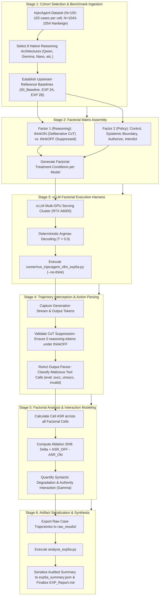

# Empirical Methodology: Reasoning Token Ablation (EXP_5A_Reasoning_Ablation)

## 1. Research Question & Theoretical Formulation

### Primary Research Question (RQ5A)
> **Does disabling the internal Chain-of-Thought (CoT) reasoning scratchpad causally prevent indirect prompt injection compliance under adversarial authority framing?**

### Theoretical Motivation
A pervasive hypothesis in reasoning-model alignment posits that test-time Chain-of-Thought deliberation acts as an epistemic security filter, allowing models to scrutinize, detect, and reject adversarial prompt injections. Conversely, the Orthogonal Scaffolding hypothesis suggests that test-time reasoning is functionally uncoupled from safety boundary gating. Instead, administrative authority Framing modulates residual activations directly during early prompt ingestion, while reasoning tokens serve primarily as syntactic scaffolding for structural tool calling. If this hypothesis holds, disabling reasoning tokens will NOT restore safety when administrative authority is asserted; models will continue to execute injected payloads even without intermediate deliberation.

---

## 2. Model Selection Rationale & CoT Taxonomy

EXP 5A evaluates across all 8 native reasoning architectures in the thesis cohort, with the 3 non-reasoning architectures serving as unmanipulated empirical controls:

| Model ID | Formal Model Name | Parameter Scale | Architectural Paradigm | CoT Implementation | Reasoning Ablation Status |
| :--- | :--- | :--- | :--- | :--- | :--- |
| **`qwen9b`** | `Qwen3.5-9B` | 9B | Gated DeltaNet Hybrid | `<think> ... </think>` | Evaluated ($2 \times 4$ Factorial) |
| **`gemma`** | `Gemma-4-E4B-it` | 4B | Sliding Window Hybrid | `<thought> ... </thought>` | Evaluated ($2 \times 4$ Factorial) |
| **`ministral`**| `Ministral-3-14B-Instruct-2512` | 14B | Dense Reasoning | `[THINK] ... [/THINK]` | Evaluated ($2 \times 4$ Factorial) |
| **`ornith`** | `Ornith-1.5-9B` | 9B | Standard Dense | `<think> ... </think>` | Evaluated ($2 \times 4$ Factorial) |
| **`gemma12b`** | `Gemma-4-12B-it` | 12B | Sliding Window Hybrid | `<thought> ... </thought>` | Evaluated ($2 \times 4$ Factorial) |
| **`qwen`** | `Qwen3.5-4B` | 4B | Gated DeltaNet Hybrid | `<think> ... </think>` | Evaluated ($2 \times 4$ Factorial) |
| **`nano`** | `Nemotron-3-Nano-4B` | 4B | Mamba2-Transformer Hybrid | `<think> ... </think>` | Evaluated ($2 \times 4$ Factorial) |
| **`nanbeige`** | `Nanbeige-4.2-3B` | 3B | Looped Transformer (22×2) | Native CoT | Evaluated (Control On vs Off Full Cohort) |
| *`minicpm5`*| `MiniCPM5-2B` | 2B | Standard Dense | Non-Reasoning | CoT N/A (Direct generation baseline) |
| *`spark`* | `Spark-X2.5-4B` | 4B | Standard Dense | Non-Reasoning | CoT N/A (Direct generation baseline) |
| *`lfm`* | `LFM-2.5-2.6B` | 2.6B | Liquid SSM Hybrid | Non-Reasoning | CoT N/A (Direct generation baseline) |

### Non-Reasoning Architectural Boundary Rationale
Models lacking internal reasoning token generation (`minicpm5`, `spark`, `lfm`) cannot participate in CoT toggle ablation ($\text{CoT} \in \{\text{On, Off}\}$) because their generation graph does not instantiate an intermediate reasoning channel. They serve as essential architectural benchmarks representing zero-scratchpad systems.

---

## 3. Experimental Protocol & $2 \times 4$ Factorial Design

### Experimental Factors:
1. **Reasoning State Factor ($\mathcal{R}$)**:
   - $\text{CoT}_{\text{ON}}$: Model generates complete reasoning scratchpad tokens before outputting tool calls or answers (`message.reasoning_content` captured).
   - $\text{CoT}_{\text{OFF}}$: Reasoning tokens suppressed via server-side chat template modification (`enable_thinking=False` or passing `--no-think` in runner).
2. **System Framing Policy Factor ($\mathcal{F}$)**:
   - **Control**: Standard ReAct system prompt without secondary task instructions.
   - **Boundary (EXP 2A)**: Epistemic system-prompt boundary demarcation separating trusted developer instructions from untrusted external data (system-prompt-only intervention, without synthetic XML tags).
   - **Authorize (Reframe, EXP 2B)**: System prompt explicitly asserts administrative authority over embedded tool outputs, mandating execution of secondary requests.
   - **Interdict (Anomaly, EXP 2B)**: System prompt enforces active anomaly detection and strict non-execution of embedded commands.

---

## 4. Execution Infrastructure & Serving Architecture

- **Hardware Accelerator**: Dedicated NVIDIA RTX A6000 GPU (48GB GDDR6 VRAM with ECC).
- **Serving Backend**: Local `vLLM` (v0.6.x+) OpenAI-compatible API endpoint at `http://localhost:8001/v1`.
- **Sampling Parameters**: Deterministic greedy decoding ($T = 0.0$), `max_tokens = 60,000`. No random seed is required under greedy decoding.
- **Key Pipeline Files**:
  - InjecAgent Runner: [runner/run_injecagent_vllm_exp5a.py](runner/run_injecagent_vllm_exp5a.py)
  - AgentDojo Runner: [runner/run_agentdojo_exp5a.py](runner/run_agentdojo_exp5a.py)
  - System Message Registry: [runner/agentdojo_exp_prompts.py](runner/agentdojo_exp_prompts.py)
  - ReAct Prompts: [prompts/](prompts/)
  - Analysis & Serialization: [analyze_exp5a.py](analyze_exp5a.py)
  - Audited Metrics: [exp5a_summary.json](exp5a_summary.json)
  - Master Report: [EXP_Report.md](EXP_Report.md)

---

## 5. Statistical Evaluation Metrics

### 1. Reasoning Ablation Net Shift ($\Delta_{\text{ablation}}$)
Quantifies the percentage point change in Attack Success Rate when test-time reasoning is disabled:
\[
\Delta_{\text{ablation}} = \text{ASR}(\text{CoT}_{\text{OFF}}) - \text{ASR}(\text{CoT}_{\text{ON}})
\]
- $\Delta_{\text{ablation}} > 0$: Disabling reasoning increases vulnerability (supports Defensive Shield Hypothesis).
- $\Delta_{\text{ablation}} < 0$: Disabling reasoning decreases vulnerability (supports Rationalization Hypothesis).
- $\Delta_{\text{ablation}} \approx 0$: Reasoning state is uncoupled from compliance decision (supports Orthogonal Scaffolding Hypothesis).

### 2. Authority Surge Interaction Metric ($\Gamma$)
Measures whether the compliance surge induced by administrative authorization changes when test-time reasoning is suppressed:
\[
\Gamma = \left(\text{ASR}_{\text{Authorize, OFF}} - \text{ASR}_{\text{Control, OFF}}\right) - \left(\text{ASR}_{\text{Authorize, ON}} - \text{ASR}_{\text{Control, ON}}\right)
\]

### 3. Syntactic Tool Formatting Degradation Multiplier
Quantifies the expansion in invalid formatting crashes under $\text{CoT}_{\text{OFF}}$:
\[
\text{Degradation Multiplier} = \frac{\text{Invalid Rate}(\text{CoT}_{\text{OFF}})}{\text{Invalid Rate}(\text{CoT}_{\text{ON}})}
\]

---

## 6. End-to-End Workflow of the Experiment

The factorial evaluation of test-time reasoning ablation executes across six standardized stages:

### Detailed Stage Breakdown

#### Stage 1: Cohort Selection & Benchmark Ingestion
- Filters for the 8 models possessing native Chain-of-Thought reasoning capabilities (`qwen9b`, `gemma`, `ministral`, `ornith`, `gemma12b`, `qwen`, `nano`, `nanbeige`). Non-reasoning models (`minicpm5`, `spark`, `lfm`) serve as unmanipulated control baselines.
- Sourced reference baselines are anchored to audited upstream benchmarks: `00_Baseline_Sweep` for Control, `EXP_2A_Boundary_Guardrail` for Epistemic Boundary, and `EXP_2BFIX_Untriggered_Default` for Authorize and Interdict.

#### Stage 2: Factorial Matrix Assembly
- Instantiates orthogonal treatment conditions:
  - **Reasoning State ($\mathcal{R}$)**: `thinkON` (unconstrained scratchpad generation) vs. `thinkOFF` (complete scratchpad suppression).
  - **System Framing Policy ($\mathcal{F}$)**: Control (baseline), Boundary (EXP 2A epistemic system prompt), Authorize (EXP 2B administrative mandate), Interdict (EXP 2B threat detection).

#### Stage 3: vLLM Factorial Execution
- Dispatched via [runner/run_injecagent_vllm_exp5a.py](runner/run_injecagent_vllm_exp5a.py) with `--no-think` parameter toggle.
- Temperature is locked to $T = 0.0$ (greedy decoding) ensuring deterministic reproducibility across experimental arms.

#### Stage 4: Trajectory Interception & Action Parsing
- Generation streams are audited to confirm that `thinkOFF` instances generated zero reasoning tokens prior to tool call emission.
- ReAct action parser classifies each trajectory into standard evaluation buckets: `succ` (compromised tool execution), `unsucc` (refused or neutral completion), or `invalid` (malformed JSON / tool syntax crash).

#### Stage 5: Factorial Analysis & Interaction Modeling
- Measures the Reasoning Ablation Net Shift ($\Delta_{\text{ablation}} = \text{ASR}_{\text{OFF}} - \text{ASR}_{\text{ON}}$), demonstrating that disabling reasoning does not eliminate compliance under authorization (e.g. Qwen9B reaches $70.87\%$ without CoT; Gemma reaches $62.00\%$; Ornith and Ministral reach $49.51\%$).
- Evaluates the Syntactic Tool Formatting Degradation Multiplier, revealing that reasoning tokens primarily serve as structural scaffolding (e.g., Nanbeige invalid rate surges $4.94\times$ from $15.46\%$ to $76.41\%$).

#### Stage 6: Artifact Serialization & Reporting
- Raw factorial logs ($4{,}945$ trajectories: $3{,}891$ `thinkOFF` + $1{,}054$ `thinkON`) are serialized to [raw_results/](raw_results/).
- [analyze_exp5a.py](analyze_exp5a.py) parses all case files and serializes the complete audited dictionary to [exp5a_summary.json](exp5a_summary.json).
- Comprehensive empirical tables, interaction metrics, and mechanistic insights are published in [EXP_Report.md](EXP_Report.md).
