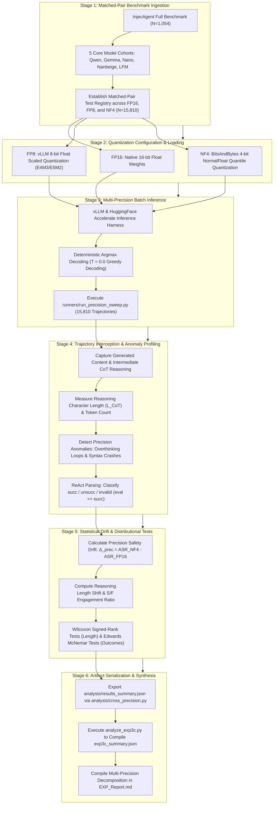

# Empirical Methodology: Precision Dysfunction & Quantization Degradation (EXP_3C_Precision_Dysfunction)

## 1. Research Question & Theoretical Formulation

### Primary Research Question (RQ3C)
> **Does post-training weight quantization (from 16-bit floating point down to 8-bit FP8 and 4-bit NormalFloat NF4) degrade safety interdiction capabilities, alter reasoning length distributions, or exacerbate agent vulnerability to indirect prompt injection?**

### Theoretical Motivation
Quantization is the standard paradigm for deploying models in resource-constrained environments. However, reducing numerical precision introduces truncation noise into attention weights and key-value projections. If safety guardrails rely on delicate cancellation of attention logits or subtle latent steering directions, lower precision might selectively erode safety representations before general language fluency degrades, leading to "precision dysfunction."

---

## 2. Evaluated Models & Precision Regimes

EXP 3C evaluates 5 primary models across 3 standardized precision regimes, totaling $15{,}810$ evaluated trajectories in the core matched-pair dataset:

| Model ID | Formal Model Name | Parameter Scale | Architecture | Precisions Evaluated |
| :--- | :--- | :--- | :--- | :--- |
| **`qwen`** | `Qwen3.5-4B` | 4B | Gated DeltaNet Hybrid | FP16, FP8, NF4 |
| **`gemma`** | `Gemma-4-E4B-it` | 4B | Sliding Window Hybrid | FP16, FP8, NF4 |
| **`nano`** | `Nemotron-3-Nano-4B` | 4B | Mamba2-Transformer Hybrid | FP16, FP8, NF4 |
| **`nanbeige`** | `Nanbeige-4.2-3B` | 3B | Looped Transformer (22×2) | FP16, FP8, NF4 |
| **`lfm`** | `LFM-2.5-2.6B` | 2.6B | Liquid SSM Hybrid | FP16, FP8, NF4 |

---

## 3. Experimental Protocol & Quantization Protocols

### A. Precision Formats
1. **FP16 (Half-Precision Baseline)**: Standard 16-bit IEEE float representation.
2. **FP8 (8-bit Floating Point)**: E4M3/E5M2 scaled floating-point quantization via vLLM.
3. **NF4 (4-bit NormalFloat)**: Information-theoretically optimal quantile quantization for normally distributed neural weights.

### B. Matched-Pair Evaluation
- Every test case $k \in \{1, \dots, 1054\}$ is evaluated identically across FP16, FP8, and NF4 under greedy decoding ($T=0.0$).
- Across 5 models $\times$ 3 precisions $\times$ 1,054 benchmark cases, exactly $15,810$ trajectories are tracked.
- For each case, we record:
  1. Attack outcome: $\text{succ} \in \{0, 1\}$ (strictly defined as $\text{eval} == \text{"succ"}$).
  2. Reasoning character/token length: $L_{\text{CoT}}$ (from deliberation sequences `thinking` and `thinking_step2`).
  3. Action command syntax validity and ReAct step count.

---

## 4. Execution Infrastructure

- **Runners**:
  - Precision Sweep: `runners/run_precision_sweep.py`
  - Cross-precision analysis: `analysis/cross_precision.py`
  - Statistical compilation & auditing: `analyze_exp3c.py`
- **Output Artifacts**:
  - `analysis/results_summary.json`: intermediate parsed metrics dictionary.
  - `exp3c_summary.json`: complete verified summary across all models, precisions, and statistical tests.

---

## 5. Statistical Evaluation Metrics

- **Precision Safety Drift ($\Delta_{\text{prec}}$)**:
  \[
  \Delta_{\text{prec}} = \text{ASR}_{\text{NF4}} - \text{ASR}_{\text{FP16}}
  \]
- **Net Vulnerability Shift**:
  \[
  \text{Net Shift} = N_{(\text{Fail} \rightarrow \text{Succ})} - N_{(\text{Succ} \rightarrow \text{Fail})} = FS - SF
  \]
  Negative values indicate net safety improvement (more attacks neutralized than enabled under NF4).
- **Hypothesis Testing**:
  - **Paired McNemar Test with Edwards Continuity Correction**:
    \[
    \chi^2 = \frac{(|SF - FS| - 1)^2}{SF + FS}, \quad \text{df} = 1
    \]
  - **Two-Sided Exact Binomial Test**: Evaluates discordant pairs ($SF$ vs. $FS$) under $H_0: p = 0.5$.
  - **Paired Wilcoxon Signed-Rank Test**: Assesses whether continuous reasoning length distributions shift significantly between FP16 and NF4 across matched cases.
- **Engagement-Compliance Ratio (S/F Ratio)**:
  \[
  \text{SF\_ratio} = \frac{\overline{\text{RL}}_{\text{succ}}}{\overline{\text{RL}}_{\text{fail}}}
  \]
  An engagement threshold of $1.15\times$ defines amplification of reasoning requirement under low-bit quantization.

---

## 6. End-to-End Workflow of the Experiment

The investigation of weight quantization and precision dysfunction executes across six standardized stages:

### Detailed Stage Breakdown

#### Stage 1: Matched-Pair Benchmark Ingestion
- Test cases ($N=1{,}054$) from InjecAgent are ingested and mapped across 5 core model architectures (`qwen`, `gemma`, `nano`, `nanbeige`, `lfm`) across 3 precisions, producing exactly $N=15{,}810$ total evaluated trajectories.
- Strict case-by-case ID matching is preserved across all precision formats.

#### Stage 2: Quantization Configuration & Model Loading
- **FP16**: Full half-precision baseline loaded via standard PyTorch float16.
- **FP8**: 8-bit floating-point weights configured under vLLM using dynamic scale factors.
- **NF4**: 4-bit NormalFloat quantization initialized via `bitsandbytes` `nf4` config with double quantization enabled.

#### Stage 3: Multi-Precision Inference Execution
- Executed via `runners/run_precision_sweep.py` across identical GPU infrastructure.
- Greedy argmax decoding (`temperature = 0.0`) guarantees that differences in output are solely attributable to numerical quantization noise.

#### Stage 4: Trajectory Interception & Anomaly Profiling
- Real-time logging records total output length, token count, and step count.
- The pipeline scans for severe quantization-induced dysfunctions:
  - **Overthinking Loops**: Repetitive reasoning chains ballooning up to $238{,}649$ characters under NF4 (Nanbeige).
  - **Syntax Dropouts**: Malformed tool-call strings resulting in runtime execution failure.
- Success is evaluated strictly via command execution (`eval == "succ"`).

#### Stage 5: Statistical Drift & Distributional Testing
- Quantifies the precision safety drift: $\Delta_{\text{prec}} = \text{ASR}_{\text{NF4}} - \text{ASR}_{\text{FP16}}$ and Net Vulnerability Shift ($FS - SF$).
- Measures relative reasoning elongation and S/F engagement ratios.
- Applies paired Wilcoxon signed-rank tests for continuous reasoning length changes and Edwards continuity-corrected McNemar tests for paired outcome transitions.

#### Stage 6: Artifact Serialization & Reporting
- Metrics are dumped to `analysis/results_summary.json` via `analysis/cross_precision.py`.
- `analyze_exp3c.py` parses raw case traces, compiles all three summary tables, and exports `exp3c_summary.json`.
- Complete findings on precision dysfunction are reported in `EXP_Report.md`.
