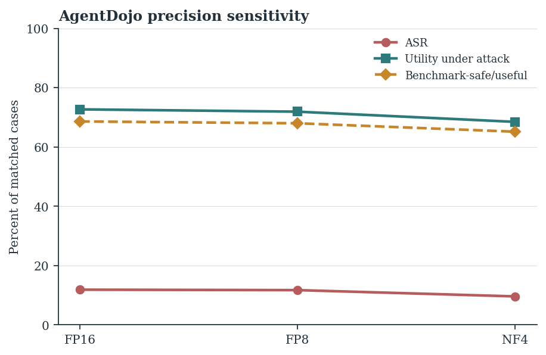

# 📉 Cross-Precision Serving Dynamics & Syntax Collapse

> **Thesis Chapter Reference**: Chapter 5, §5.2.3 & §5.4.5 ("Numerical Precision Regimes and Quantization") & Chapter 6, §6.5.6 ("Numerical Precision")  
> **Key Results**: Table 6.9 (Cross-precision reasoning dynamics and syntax collapse on InjecAgent, $N=15{,}810$) & Figure 6.5 (AgentDojo precision sensitivity)

---

## 1. Experimental Overview

Edge serving of autonomous tool-using agents frequently requires post-training weight quantization. This experiment analyzes how precision degradation (**FP16, FP8, and NF4**) alters reasoning length, Engagement-Compliance ratios ($\text{Ratio}_{\text{S/F}}$), tool syntax validity, and attack vulnerability across **15,810 matched trajectories** (5 models $\times$ 3 precisions $\times$ 1,054 cases).

$$\text{Ratio}_{\text{S/F}} = \frac{\overline{L}_{\text{succ}}}{\overline{L}_{\text{fail}}}$$

<div align="center">
  
  <p><em>Figure: AgentDojo precision sensitivity across FP16, FP8, and NF4 (N=949 matched episodes). In pooled terms, quantization slightly lowers targeted ASR but simultaneously degrades utility under attack and safe utility.</em></p>
</div>

---

## 2. Key Empirical Findings

1. 🔄 **Non-Uniform Vulnerability Drift**: Moving from FP16 to NF4 changed ASR in opposite directions across models:
   * `Qwen-4B`: ASR decreased from $18.8\% \to 13.3\%$.
   * `Nemotron-Nano-4B`: ASR increased from $2.6\% \to 4.8\%$ ($SF=12, FS=36$, McNemar $p = 9.01 \times 10^{-4}$).
2. 💥 **Apparent Safety via Tool Syntax Dropout**:
   In `Qwen-4B`, lower ASR under NF4 was accompanied by a **$6\times$ surge in invalid tool calls** ($19 \to 115$). The agent appeared "safer" solely because quantization degraded its ability to emit syntactically valid JSON function arguments.
3. 📉 **AgentDojo Utility Degradation**:
   On AgentDojo ($N=949$ matched episodes), while pooled ASR dropped slightly by $2.33\,\text{pp}$ from FP16 to NF4, **Utility Under Attack (UA) degraded by $4.75\,\text{pp}$** ($72.73\% \to 67.98\%$) and Safe Utility ($S0U1$) dropped by $3.97\,\text{pp}$ ($68.77\% \to 64.80\%$).

---

## 3. Directory Layout

* `analyze_precision_dynamics.py`: Parses reasoning character lengths, computes S/F engagement ratios, and tracks syntax failures.
* `precision_dynamics_summary.json`: Multi-precision aggregated metrics.
* `analysis/cross_precision.py`: Offline trajectory parsing pipeline.
* `runners/`: Quantization execution scripts.
* `EXP_Report.md`: Full empirical report.

---

## 4. Instant Reproduction Command

```bash
python analyze_precision_dynamics.py
```
